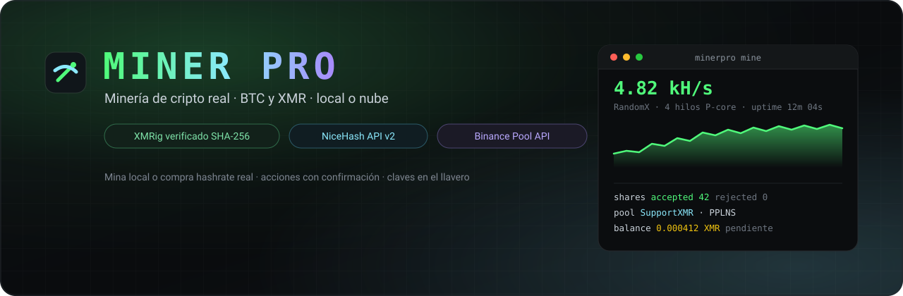
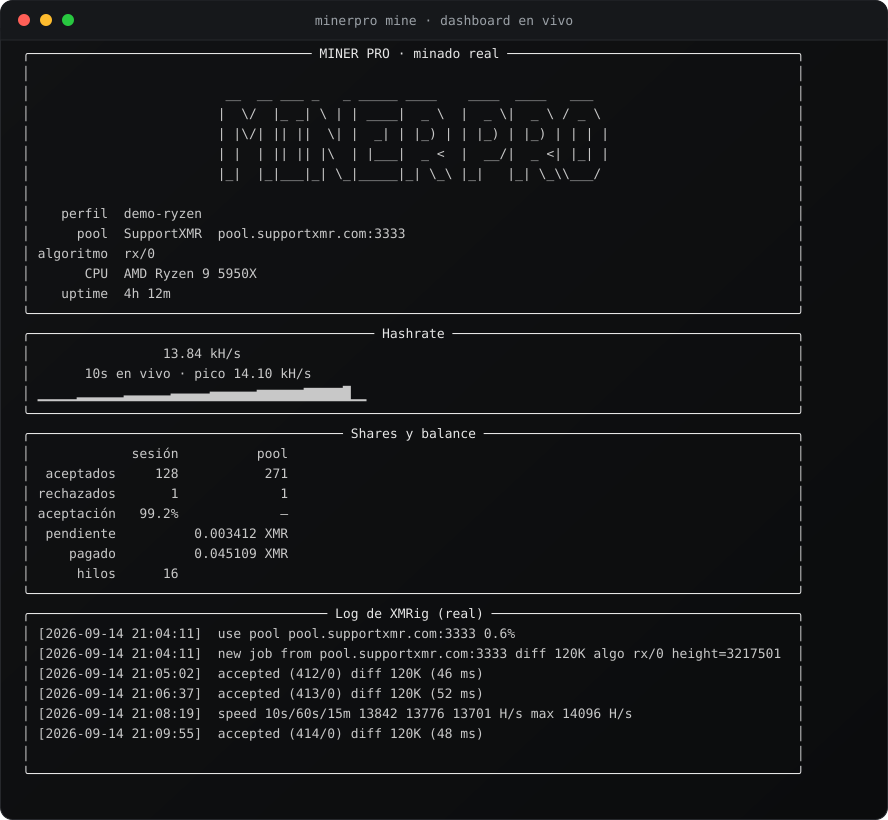
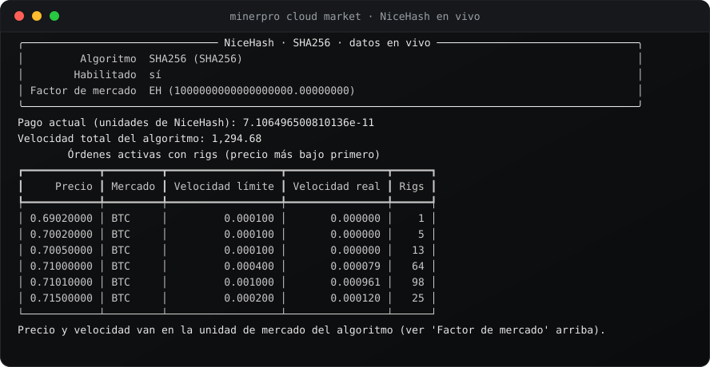
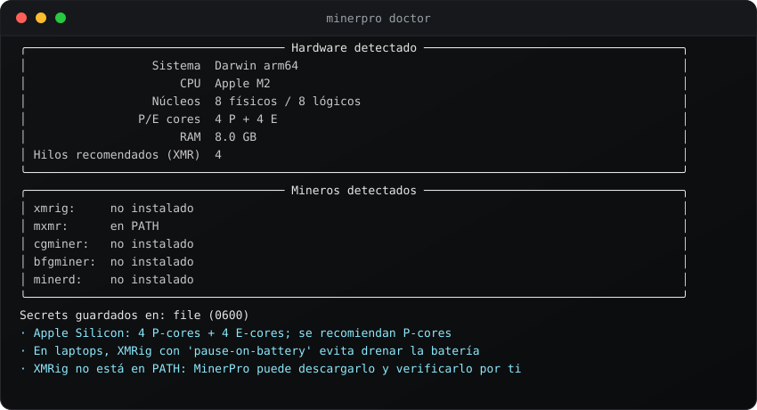
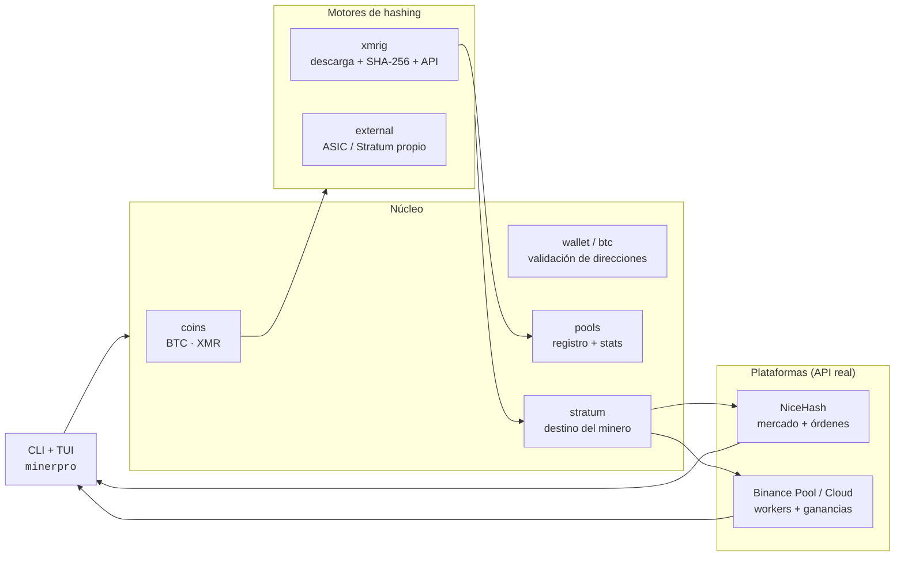

<div align="center">



<br>

**Mina criptomonedas de verdad.** Local con tu hardware, o en la nube comprando
hashrate real en NiceHash. Todo validado, todo verificado, y cada acción que gasta
dinero pasa por tu confirmación.

<br>

[](https://www.python.org/)
[](#-licencia)
[](#-desarrollo)
[](https://github.com/mildredhoe/iminerpro/actions/workflows/ci.yml)
[](https://github.com/mildredhoe/iminerpro/stargazers)

[](#-monedas-y-modos)
[](#-monedas-y-modos)
[](#-plataformas)
[](#-plataformas)

<br>

[Inicio rápido](#-inicio-rápido) ·
[Cómo funciona](#-cómo-funciona) ·
[Comandos](#-comandos) ·
[Plataformas](#-plataformas) ·
[Acceso y seguridad](#-acceso-y-seguridad) ·
[Roadmap](#-roadmap)

</div>

---

## 💡 Qué es MinerPro

Una herramienta de terminal que **mina criptomonedas de verdad**: hashea en tu equipo
o compra hashrate en la nube, y te muestra el resultado en un dashboard en vivo.

No hay números inventados en ninguna pantalla:

- 🔍 **Datos reales.** Hashrate y shares salen de la API local del minero; balance
  pendiente/pagado, de la API pública de tu pool.
- 📈 **Mercado en vivo.** `minerpro cloud market` lee el order book de NiceHash en
  tiempo real, sin claves.
- 🛠️ **Acciones de verdad.** Registrar tu pool, comprar hashrate, recargar y cancelar
  órdenes: todo contra la API real, y siempre con tu confirmación explícita.
- 🛡️ **Verificado.** XMRig se descarga **solo** del release oficial y se valida por
  **SHA-256** antes de ejecutarse.

> [!WARNING]
> Mina **solo en equipos de tu propiedad** o con permiso explícito. La minería consume
> electricidad y calienta el hardware, y comprar hashrate gasta dinero real. Los
> "contratos de cloud mining" de terceros tienen riesgo alto de estafa: MinerPro los
> cataloga con su nivel de riesgo, pero **nunca** firma uno por ti.

---

## 🖼️ Así se ve

<div align="center">

**Dashboard de minado en vivo** (datos de ejemplo, así se ve con tu equipo real)



<br><br>

**Mercado de hashrate de NiceHash en vivo** (esta captura se regenera desde la API real)



<br><br>

**Detección de hardware**



<sub>
Los SVG se generan desde la salida real de los comandos con
<code>scripts/make_readme_assets.py</code>. El dashboard y el hardware usan datos
genéricos de ejemplo (así se ve en un equipo típico); el mercado se lee de la API
pública de NiceHash en vivo.
</sub>

</div>

---

## 🧭 Cómo funciona



**Dos formas de minar:**

```mermaid
sequenceDiagram
    autonumber
    actor U as Usuario
    participant MP as MinerPro
    participant M as Minero (XMRig / ASIC)
    participant P as Pool o plataforma

    rect rgb(20, 32, 24)
    note over U,P: Local
    U->>MP: minerpro mine -c XMR -w <wallet>
    MP->>MP: valida wallet + verifica XMRig (SHA-256)
    MP->>M: lanza con config.json (pool + wallet)
    M->>P: login Stratum
    P-->>M: jobs y dificultad
    M-->>MP: hashrate y shares (API local)
    MP-->>U: dashboard en vivo
    end

    rect rgb(24, 24, 38)
    note over U,P: Nube (comprar hashrate)
    U->>MP: minerpro cloud market
    MP->>P: order book real de NiceHash
    U->>MP: cloud pool-add + cloud buy --confirm
    MP->>P: crea pool y orden de hashrate
    P-->>U: hashrate minando hacia tu pool
    end
```



---

## 🚀 Inicio rápido

### Instalación

```bash
git clone https://github.com/mildredhoe/iminerpro.git
cd iminerpro
uv venv .venv && uv pip install -e .      # o: pipx install .
```

> Requiere **Python 3.10+**. No necesitas compilar nada.

### Explora sin gastar nada

```bash
minerpro doctor                       # detecta tu hardware y los mineros disponibles
minerpro demo mine                    # cómo se ve el dashboard (datos de ejemplo)
minerpro coins                        # BTC vs XMR: qué conviene en tu equipo
minerpro wallet <tu_direccion>        # valida una wallet XMR o BTC (checksum real)
minerpro cloud market --algo SHA256   # mercado de hashrate en vivo, sin claves
minerpro plan -c XMR -w <tu_xmr>      # explica qué haría, sin ejecutar nada
```

### Minar en local

```bash
# XMR con XMRig + dashboard en vivo
minerpro mine -c XMR -w <tu_xmr>

# BTC con tu ASIC o minero Stratum
minerpro mine -c BTC -w <tu_btc> --miner-cmd "cgminer -o {url} -u {user} -p {pass}"
```

### Minar en la nube (comprar hashrate)

```bash
minerpro cloud guide nicehash            # cómo crear la API key, paso a paso
minerpro cloud connect nicehash          # la guardas en el llavero del sistema

minerpro cloud market -a SHA256          # mira precios reales antes de comprar
minerpro cloud pool-add --name mi-pool --algo SHA256 \
    --host pool.supportxmr.com --port 3333 --username <tu_wallet> --confirm
minerpro cloud buy -a SHA256 --market EU --price 0.0001 --amount 0.001 \
    --limit 1 --pool-id <id> --confirm   # sin --confirm no se ejecuta
```

---

## 🧰 Comandos

### Locales

| Comando | Qué hace | ¿Mina? |
|---|---|:---:|
| `minerpro doctor` | Detecta hardware y mineros disponibles | No |
| `minerpro demo [mine\|doctor]` | Muestra la interfaz con datos de ejemplo | No |
| `minerpro coins` | BTC y XMR: cómo se mina en local y nube | No |
| `minerpro pools [--coin XMR]` | Pools reales con fee y API de stats | No |
| `minerpro wallet <dir>` | Valida una dirección XMR o BTC | No |
| `minerpro install` | Descarga y verifica XMRig (SHA-256) | No |
| `minerpro plan -c XMR -w <dir>` | Explica exactamente qué haría | No |
| `minerpro poolstats -w <dir> -p <pool>` | Balance real reportado por la pool | No |
| `minerpro mine ... --dry-run` | Muestra el plan y no ejecuta nada | No |
| **`minerpro mine ...`** | **Arranca el minado real** | **Sí** |

### Plataformas

| Comando | Qué hace | ¿Gasta dinero? |
|---|---|:---:|
| `minerpro cloud platforms` | Plataformas conectables | No |
| `minerpro cloud providers` | Catálogo con nivel de riesgo | No |
| `minerpro cloud guide <id>` | Cómo obtener las API keys y dónde pegarlas | No |
| `minerpro cloud connect <id>` | Guarda credenciales en el llavero | No |
| `minerpro cloud market -a SHA256` | Order book en vivo de NiceHash (sin claves) | No |
| `minerpro cloud status nicehash` | Balance de tu cuenta | No |
| `minerpro cloud rigs` | Tus rigs reportando a NiceHash | No |
| `minerpro cloud orders -a SHA256` | Tus órdenes de hashrate | No |
| `minerpro cloud workers -a sha256d --account X` | Workers de Binance Pool | No |
| `minerpro cloud earnings -a sha256d --account X` | Ganancias de Binance Pool | No |
| `minerpro cloud pool-add ... --confirm` | Registra tu pool en NiceHash | No |
| `minerpro cloud buy ... --confirm` | Compra hashrate en NiceHash | **Sí (BTC)** |
| `minerpro cloud refill ... --confirm` | Recarga una orden existente | **Sí (BTC)** |
| `minerpro cloud cancel ... --confirm` | Cancela una orden | No |

---

## 🪙 Monedas y modos

| Moneda | Algoritmo | Local | Nube | Realidad honesta |
|---|---|---|---|---|
| **Monero (XMR)** | RandomX `rx/0` | XMRig (CPU), P2Pool | NiceHash (paga en BTC) | La mejor opción para minar local en un PC normal |
| **Bitcoin (BTC)** | SHA-256d | ASIC / Stratum propio | Binance Pool, NiceHash, pools solo | En un PC es inviable para ganar: lotería o ASIC |

---

## ☁️ Plataformas

| Plataforma | Tipo | Monedas | Lectura | Acciones |
|---|---|---|---|---|
| **NiceHash** | Marketplace de hashrate | BTC, XMR | Balance, rigs, órdenes, mercado | Crear pool, comprar/recargar/cancelar órdenes |
| **Binance Pool / Cloud Mining** | Pool + cloud mining | BTC | Cuenta, workers, ganancias, historial cloud | Reventa de hashrate (hashrate resale) |
| SupportXMR · MoneroOcean · HashVault | Pools XMR | XMR | Stats por wallet | ninguna (solo lectura) |
| CKPool Solo · Public Pool · Braiins | Pools BTC | BTC | Stratum / API pública | ninguna |

📖 Guía detallada de claves y permisos: [`docs/plataformas.md`](docs/plataformas.md)

---

## 🔐 Acceso y seguridad

MinerPro usa un modelo de **dos niveles**, para que un error o un script mal escrito no
pueda vaciarte la cuenta:

| Nivel | Qué permite | Cómo se activa |
|---|---|---|
| **Lectura** (por defecto) | Ver balance, rigs, workers, órdenes, mercado | Con cualquier API key de lectura |
| **Acciones** | Crear pool, comprar/recargar/cancelar órdenes, reventa de hashrate | `allow_write` en el cliente **más** `--confirm` en el comando |

Por eso verás `--confirm` en los comandos que gastan dinero: sin él, MinerPro te muestra
exactamente qué haría y **no ejecuta nada**.

Otras garantías:

- 🔑 **Sin retiros.** MinerPro nunca pide ni usa permisos de retiro (Withdrawal). Pídelos
  deshabilitados en la API key.
- 🗄️ **Claves cifradas.** Llavero del sistema (`keyring`); si no está, `~/.minerpro/secrets.json` con `0600`.
- 📁 **`.env` fuera de git.** Ya está en `.gitignore`. Plantilla en [`.env.example`](.env.example).
- ✅ **Binario verificado.** XMRig se valida contra `SHA256SUMS` del release oficial.
- 🧾 **Sin fondos por su cuenta.** MinerPro no compra contratos de terceros ni invierte nada.

---

## 📁 Estructura del proyecto

```
iminerpro/
├── src/minerpro/
│   ├── cli.py            # comandos (Typer)
│   ├── coins.py          # modelo de moneda: BTC, XMR
│   ├── wallet.py         # validación Monero (CryptoNote + Keccak-256)
│   ├── btc.py            # validación Bitcoin (base58check + bech32/bech32m)
│   ├── hardware.py       # detección de CPU/RAM y recomendación de hilos
│   ├── config.py         # perfiles y carga de .env
│   ├── secrets.py        # claves en el llavero del sistema
│   ├── stratum.py        # destino Stratum para el minero
│   ├── demo.py           # datos de ejemplo marcados como DEMO
│   ├── tui.py            # dashboard en vivo (Rich)
│   ├── engines/          # xmrig (gestionado), external (ASIC/Stratum)
│   ├── pools/            # registro de pools + stats por wallet
│   └── platforms/        # nicehash (mercado + órdenes), binance, catálogo
├── docs/plataformas.md   # cómo obtener y colocar las API keys
├── scripts/              # generación de los SVG del README
├── assets/               # banner y capturas
└── tests/                # 29 tests
```

---

## 🗺️ Roadmap

| Estado | Hito |
|:---:|---|
| ✅ | CLI, detección de hardware, perfiles |
| ✅ | Validación de wallets XMR y BTC |
| ✅ | Minado local XMR con XMRig gestionado + TUI en vivo |
| ✅ | Minado local BTC vía minero externo Stratum |
| ✅ | Stats de pool por wallet |
| ✅ | NiceHash: mercado en vivo, balance, rigs, órdenes |
| ✅ | NiceHash: comprar, recargar y cancelar hashrate (con confirmación) |
| ✅ | Binance Pool: workers, ganancias, reventa de hashrate |
| 🚧 | Estimador de costo/beneficio con datos reales del mercado |
| 🚧 | Histórico en SQLite |
| ⏳ | Backend nativo RandomX para Apple Silicon |
| ⏳ | Binarios y distribuidores: Homebrew, winget, `curl \| sh` |
| 💡 | Más monedas (RVN, RTM) y más plataformas |

---

## ❓ Preguntas frecuentes

<details>
<summary><b>¿Los comandos de nube realmente funcionan o solo muestran datos?</b></summary>

Hacen las dos cosas. `cloud market` lee el order book real de NiceHash sin claves.
`cloud buy`, `cloud refill`, `cloud cancel` y `cloud pool-add` ejecutan la acción real
en tu cuenta cuando agregas `--confirm`.
</details>

<details>
<summary><b>¿Por qué hay un modo lectura y otro de acciones?</b></summary>

Porque las mismas claves que compran hashrate podrían, con un bug, gastar de más. El
modo lectura es el default; las acciones piden `allow_write` en el cliente y `--confirm`
en el comando. Así lo que gasta dinero siempre pasa por una decisión tuya.
</details>

<details>
<summary><b>¿Empieza a minar solo cuando lo instalo?</b></summary>

No. No hay daemons, ni cron, ni procesos en segundo plano. Solo se mina (y solo se
compra hashrate) cuando ejecutas el comando correspondiente.
</details>

<details>
<summary><b>¿Es seguro conectar mi cuenta de Binance o NiceHash?</b></summary>

Sí, con API keys de **lectura** y (en Binance) restricción de IP. Si además quieres
comprar hashrate, habilita escritura solo en Mining y **nunca** retiros.
</details>

<details>
<summary><b>¿Por qué BTC en un PC no sirve?</b></summary>

La red de Bitcoin usa ASIC. Un CPU/GPU no compite. Para BTC, MinerPro apunta tu ASIC,
usa una pool solo (lotería) o compra hashrate en la nube.
</details>

---

## 🤝 Contribuir

1. Fork y rama: `git checkout -b feat/mi-mejora`
2. Desarrollo: `uv venv .venv && uv pip install -e ".[dev]"`
3. Antes del PR: `pytest -q && ruff check src tests`
4. Abre el Pull Request contando qué problema resuelve.

## 🛠️ Desarrollo

```bash
uv venv .venv && uv pip install -e ".[dev]"
pytest -q                 # 29 tests
ruff check src tests      # lint

# regenerar los SVG del README desde la salida real
python scripts/make_readme_assets.py
```

---

## 📜 Licencia

MIT. Ver [`LICENSE`](LICENSE).

<br>

<div align="center">

**MinerPro** · minería real, decisiones tuyas.

Hecho con ⛏️ para quienes quieren entender antes de minar.

[Volver arriba](#-minerpro)

</div>
