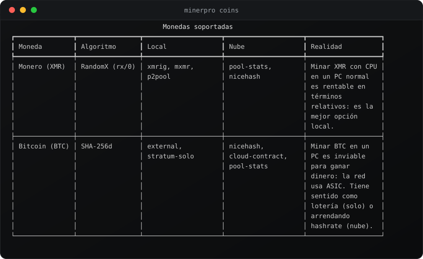
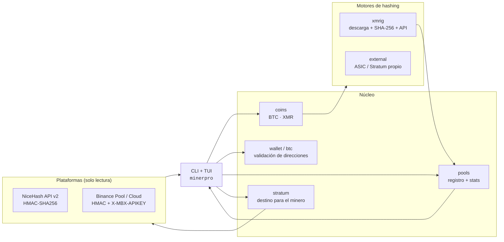
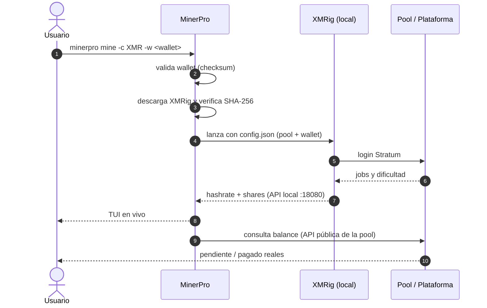

<div align="center">


<br>

**Mina criptomonedas de verdad, sin humo y sin sorpresas.**
Todo queda listo en un comando: tu wallet validada, tu pool elegida, el minero verificado
y el dashboard en vivo. **El minado lo arrancas tú.**

<br>

[](https://www.python.org/)
[](#-licencia)
[](#-desarrollo)
[](https://github.com/mildredhoe/iminerpro/actions/workflows/ci.yml)
[](#-inicio-rápido)
[](https://github.com/mildredhoe/iminerpro/stargazers)

[](#-monedas-y-modos)
[](#-monedas-y-modos)
[](#-plataformas-y-nube)
[](#-seguridad)

<br>

[Inicio rápido](#-inicio-rápido) ·
[Características](#-características) ·
[Cómo funciona](#-cómo-funciona) ·
[Comandos](#-comandos) ·
[Plataformas](#-plataformas-y-nube) ·
[Seguridad](#-seguridad) ·
[Roadmap](#-roadmap)

</div>

---

## 💡 Qué es MinerPro

MinerPro es una herramienta de terminal que **prepara y ejecuta minería real** de
criptomonedas en tu propio equipo o apuntando tu hardware a plataformas de la nube.

La mayoría de los "mineros fáciles" son una de dos cosas: un script que simula ganancias,
o una caja negra que instala software sin que sepas qué corre. MinerPro hace lo contrario:

- 🔍 **Nada simulado.** El hashrate y los shares vienen de la API local del minero; el
  balance pendiente/pagado viene de la API pública de la pool.
- 🛡️ **Nada oculto.** El binario de XMRig se descarga **solo** del release oficial y se
  verifica por **SHA-256** antes de ejecutarse.
- 🚦 **Nada automático.** MinerPro no empieza a minar al instalar ni en segundo plano.
  Revisa, decide y ejecuta.

> [!WARNING]
> Mina **solo en equipos de tu propiedad** o con permiso explícito. La minería consume
> electricidad y calienta el hardware. Los "contratos de cloud mining" tienen riesgo alto
> de estafa: MinerPro los cataloga, pero **nunca** compra ni mueve fondos.

---

## 🖼️ Así se ve

<div align="center">


<br><br>


<sub>Salidas reales de <code>minerpro coins</code> y <code>minerpro doctor</code>. Los SVG se generan
desde la salida de verdad con <code>scripts/make_readme_assets.py</code>.</sub>

</div>

---

## ✨ Características

| | Característica | Detalle |
|---|---|---|
| 🪙 | **Dos monedas** | Monero (**XMR**, RandomX, ideal en CPU) y Bitcoin (**BTC**, SHA-256d, ASIC) |
| 🖥️ | **Minado local** | XMR vía XMRig gestionado; BTC vía tu ASIC/minero Stratum |
| ☁️ | **Modo nube** | NiceHash (marketplace de hashrate) y Binance Pool / Cloud Mining, por API |
| 🔐 | **Wallets validadas de verdad** | Monero (base58 CryptoNote + checksum Keccak-256) y Bitcoin (base58check + bech32/bech32m) |
| ✅ | **Minero verificado** | XMRig se descarga del release oficial y se valida con `SHA256SUMS` |
| 📊 | **Dashboard en vivo** | Hashrate, shares aceptados/rechazados, workers y log real, en una TUI con Rich |
| 🌐 | **Stats de pool** | Balance pendiente/pagado leído de la API real de la pool para tu wallet |
| 🔑 | **Onboarding de API keys** | Guía paso a paso de cómo obtener cada clave y dónde pegarla |
| 🗄️ | **Claves seguras** | Llavero del sistema (Keychain / DPAPI / Secret Service) o archivo `0600` |
| 🧾 | **Perfiles** | Varios perfiles de minado persistidos en `~/.minerpro` |

---

## 🧭 Cómo funciona

MinerPro separa el **qué** (moneda, pool, wallet) del **cómo** (motor de hashing), así se
puede añadir una moneda o un backend sin tocar la experiencia.



**El flujo de una sesión de minado:**



---

## 🚀 Inicio rápido

### Instalación

```bash
git clone https://github.com/mildredhoe/iminerpro.git
cd minerpro
uv venv .venv && uv pip install -e .      # o: pipx install .
```

> Requiere **Python 3.10+**. No necesitas compilar nada.

### Primeros pasos (sin minar todavía)

```bash
minerpro doctor                       # detecta tu hardware y los mineros disponibles
minerpro coins                        # BTC vs XMR: qué conviene en tu equipo
minerpro wallet <tu_direccion>        # valida una wallet XMR o BTC (checksum real)

minerpro plan -c XMR -w <tu_xmr>      # explica qué haría, SIN ejecutar nada
```

### Empezar a minar (tú lo decides)

```bash
# XMR en local con XMRig + dashboard en vivo
minerpro mine -c XMR -w <tu_xmr>

# BTC con tu ASIC o minero Stratum
minerpro mine -c BTC -w <tu_btc> --miner-cmd "cgminer -o {url} -u {user} -p {pass}"
```

### Conectar la nube

```bash
minerpro cloud guide nicehash         # cómo crear la API key, paso a paso
minerpro cloud connect nicehash       # la guardas en el llavero del sistema
minerpro cloud status nicehash        # balance real (solo lectura)

minerpro cloud stratum nicehash -c XMR -w <btc_de_nicehash>   # destino para minar
```

---

## 🧰 Comandos

| Comando | Qué hace | ¿Mina? |
|---|---|:---:|
| `minerpro doctor` | Detecta hardware y mineros disponibles | No |
| `minerpro coins` | Muestra BTC y XMR: cómo se mina en local y nube | No |
| `minerpro pools [--coin XMR]` | Lista pools reales con fee y API de stats | No |
| `minerpro wallet <dir>` | Valida una dirección XMR o BTC | No |
| `minerpro install` | Descarga y verifica XMRig (SHA-256) | No |
| `minerpro plan -c XMR -w <dir>` | Explica exactamente qué haría | No |
| `minerpro poolstats -w <dir> -p <pool>` | Balance real reportado por la pool | No |
| `minerpro cloud platforms` | Plataformas conectables | No |
| `minerpro cloud guide <id>` | Cómo obtener las API keys y dónde pegarlas | No |
| `minerpro cloud connect <id>` | Guarda credenciales en el llavero | No |
| `minerpro cloud status <id>` | Consulta la cuenta (solo lectura) | No |
| `minerpro cloud stratum <id>` | Arma el destino Stratum para tu minero | No |
| `minerpro cloud providers` | Catálogo de plataformas con nivel de riesgo | No |
| `minerpro mine ... --dry-run` | Muestra el plan y no ejecuta nada | No |
| **`minerpro mine ...`** | **Arranca el minado real** | **Sí** |

---

## 🪙 Monedas y modos

| Moneda | Algoritmo | Local | Nube | Realidad honesta |
|---|---|---|---|---|
| **Monero (XMR)** | RandomX `rx/0` | XMRig (CPU), `mxmr` nativo en Mac, P2Pool | NiceHash (paga en BTC), stats de pool | Es la mejor opción para minar local en un PC normal |
| **Bitcoin (BTC)** | SHA-256d | ASIC / minero Stratum propio | Binance Pool, NiceHash, pools solo | En un PC es inviable para ganar: tiene sentido como lotería o con ASIC |

**Modos:**

- **Local**: el hashing ocurre en tu equipo. Máximo control, cero dependencia de terceros.
- **Nube**: apuntas tu hardware (o consultas) a plataformas con API. Más comodidad, más
  dependencia y más riesgo de contraparte.

---

## ☁️ Plataformas y nube

| Plataforma | Tipo | Monedas | Acceso | Permisos que pedimos |
|---|---|---|---|---|
| **NiceHash** | Marketplace de hashrate | BTC, XMR | API v2 con firma HMAC-SHA256 | `Mining` lectura + `Wallet` lectura |
| **Binance Pool / Cloud Mining** | Pool + cloud mining | BTC | HMAC en query + `X-MBX-APIKEY` | `Enable Reading` + restricción de IP |
| SupportXMR · MoneroOcean · HashVault | Pools XMR | XMR | API pública por wallet | ninguna (solo lectura) |
| CKPool Solo · Public Pool · Braiins | Pools BTC | BTC | Stratum / API pública | ninguna |

Todo se conecta **solo para leer** (balances, workers, ganancias) y para **armar el destino
Stratum** con el que tu minero empieza a minar. MinerPro **no retira, no compra contratos y
no mueve fondos**.

📖 Guía detallada: [`docs/plataformas.md`](docs/plataformas.md)

---

## 🔐 Seguridad

- 🔑 **Solo lectura.** Las API keys que MinerPro pide son de lectura. Nunca habilites retiros.
- 🗄️ **Claves cifradas.** Se guardan en el llavero del sistema (`keyring`); si no está
  disponible, en `~/.minerpro/secrets.json` con permisos `0600`.
- 📁 **`.env` fuera de git.** Ya está en `.gitignore`. Documentado en [`.env.example`](.env.example).
- ✅ **Binario verificado.** XMRig se descarga del release oficial y se compara con `SHA256SUMS`.
- 🚦 **Sin autoarranque.** No hay daemons, ni cron, ni procesos ocultos. Si no ejecutas
  `minerpro mine`, no se mina.
- ⚠️ **Contratos de cloud mining = riesgo ALTO.** Se listan para que sepas qué evitar.

---

## 📁 Estructura del proyecto

```
minerpro/
├── src/minerpro/
│   ├── cli.py            # comandos (Typer)
│   ├── coins.py          # modelo de moneda: BTC, XMR
│   ├── wallet.py         # validación Monero (CryptoNote + Keccak-256)
│   ├── btc.py            # validación Bitcoin (base58check + bech32/bech32m)
│   ├── hardware.py       # detección de CPU/RAM y recomendación de hilos
│   ├── config.py         # perfiles y carga de .env
│   ├── secrets.py        # claves en el llavero del sistema
│   ├── stratum.py        # destino Stratum para el minero
│   ├── tui.py            # dashboard en vivo (Rich)
│   ├── engines/          # xmrig (gestionado), external (ASIC/Stratum)
│   ├── pools/            # registro de pools + stats por wallet
│   └── platforms/        # nicehash, binance, catálogo con riesgo
├── docs/plataformas.md   # cómo obtener y colocar las API keys
├── scripts/              # generación de los SVG del README
├── assets/               # banner y capturas
└── tests/                # 24 tests
```

---

## 🗺️ Roadmap

| Estado | Hito |
|:---:|---|
| ✅ | CLI, detección de hardware, perfiles |
| ✅ | Validación de wallets XMR y BTC |
| ✅ | Minado local XMR con XMRig gestionado + TUI en vivo |
| ✅ | Minado local BTC vía minero externo Stratum |
| ✅ | Stats de pool por wallet |
| ✅ | NiceHash y Binance Pool por API, con onboarding de claves |
| 🚧 | Histórico en SQLite y estimador de ganancia honesto |
| ⏳ | Backend nativo RandomX para Apple Silicon |
| ⏳ | Binarios y distribuidores: Homebrew, winget, `curl \| sh` |
| 💡 | Más monedas (RVN, RTM) y más plataformas |

---

## ❓ Preguntas frecuentes

<details>
<summary><b>¿Esto realmente mina, o simula ganancias?</b></summary>

Mina de verdad. El hashrate y los shares vienen de la API local del minero, y el balance
de la API pública de la pool. No hay números inventados en ninguna pantalla.
</details>

<details>
<summary><b>¿Empieza a minar solo cuando lo instalo?</b></summary>

No. Nunca. Solo mina cuando ejecutas `minerpro mine` sin `--dry-run`.
</details>

<details>
<summary><b>¿Es seguro conectar mi cuenta de Binance o NiceHash?</b></summary>

Sí, siempre que uses API keys de **solo lectura** y (en Binance) restrinjas la IP.
MinerPro no tiene endpoints de escritura: no puede retirar ni operar.
</details>

<details>
<summary><b>¿Por qué BTC en un PC no sirve?</b></summary>

La red de Bitcoin usa ASIC. Un CPU/GPU no compite. Para BTC, MinerPro apunta tu ASIC o tu
hashrate arrendado; seamos honestos con las expectativas.
</details>

<details>
<summary><b>¿Qué necesito para XMR?</b></summary>

Una wallet Monero y un PC con al menos 4 GB de RAM. XMRig se descarga y verifica solo.
</details>

---

## 🤝 Contribuir

¡Las ideas y los PRs son bienvenidos!

1. Haz un fork y crea una rama: `git checkout -b feat/mi-mejora`
2. Instala en modo desarrollo: `uv venv .venv && uv pip install -e ".[dev]"`
3. Pasa los tests y el linter: `pytest -q && ruff check src tests`
4. Abre un Pull Request contando qué problema resuelve.

## 🛠️ Desarrollo

```bash
uv venv .venv && uv pip install -e ".[dev]"
pytest -q                 # 24 tests
ruff check src tests      # lint

# regenerar los SVG del README desde la salida real
python scripts/make_readme_assets.py
```

---

## 📜 Licencia

MIT. Ver [`LICENSE`](LICENSE).

<br>

<div align="center">

**MinerPro** · minería real, decisiones tuyas.

Hecho con ⛏️ para quienes quieren entender antes de minar.

[Volver arriba](#-minerpro)

</div>
